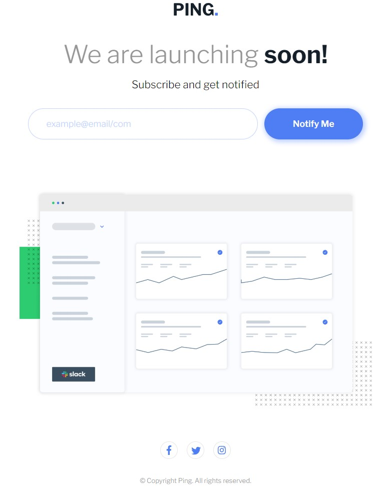
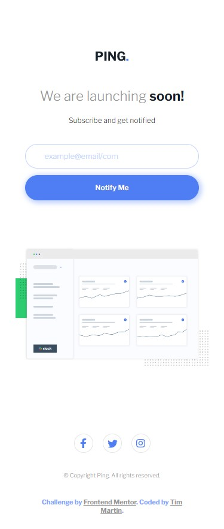

# Frontend Mentor - Ping coming soon page solution

This is a solution to the [Ping coming soon page challenge on Frontend Mentor](https://www.frontendmentor.io/challenges/ping-single-column-coming-soon-page-5cadd051fec04111f7b848da). Frontend Mentor challenges help you improve your coding skills by building realistic projects.

## Table of contents

- [Overview](#overview)
  - [The challenge](#the-challenge)
  - [Screenshot](#screenshot)
  - [Links](#links)
- [My process](#my-process)
  - [Built with](#built-with)
  - [What I learned](#what-i-learned)
  - [Continued development](#continued-development)
  - [Useful resources](#useful-resources)
- [Author](#author)

*

## Overview

### The challenge

Users should be able to:

- View the optimal layout for the site depending on their device's screen size
- See hover states for all interactive elements on the page
- Submit their email address using an `input` field
- Receive an error message when the `form` is submitted if:
  - The `input` field is empty. The message for this error should say _"Whoops! It looks like you forgot to add your email"_
  - The email address is not formatted correctly (i.e. a correct email address should have this structure: `name@host.tld`). The message for this error should say _"Please provide a valid email address"_

### Screenshot

Desktop Layout



Mobile Layout



Social media icon hover state


### Links

- Solution URL: [Frontend Mentor](https://www.frontendmentor.io/solutions/ping-coming-soon-page-reactstyled-components-FJyQDs2MLx)
- Live Site URL: [Github Pages](https://timmartin13-frontend-mentor.github.io/ping-coming-soon-page/)

## My process

### Built with

- Flexbox
- Mobile-first workflow
- [React](https://reactjs.org/) - JS library
- [Styled Components](https://styled-components.com/) - For styles

### What I learned

I learned how to set text to grow with the view size versus setting it specifically with media queries, learned how to import icons from Font Awesome, and how to verify an email address in React using RegEx.

```css
export const Heading = styled.h1`
  font-size: 6vw;
`;
```

### Continued development

I am going to continue to develop in React but I haven't seen Styled Components in a professional environment thus far so I am going to go back to Sass when styling my components.

### Useful resources

- [Hosting React on Github pages](https://www.c-sharpcorner.com/article/how-to-deploy-react-application-on-github-pages/) - This helped me to get my React app up on github pages
- [Styled-components](https://styled-components.com/docs) - Documentation for styled-components

## Author

- Website - [My portfolio](https://timmartin13.github.io/react-portfolio/)
- Frontend Mentor - [@TimMartin13](https://www.frontendmentor.io/profile/TimMartin13)
